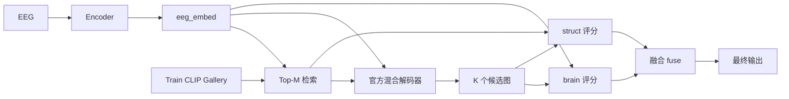

# EEG→Image 科研成果报告：ERDC 与官方 ATM 混合解码栈

> **项目**：THINGS-EEG2 脑电图像解码  
> **方法**：ERDC（Evidence-Routed Diffusion Control，证据路由扩散控制）  
> **数据**：THINGS-EEG2，测试集 200-way，主实验被试 sub-08  
> **基线**：ATM（NeurIPS 2024）官方预生成结果  
> **文档版本**：2026-08-23（对应 W14 收尾流水线 Job 527571）

---

## 目录

1. [研究背景与灵感](#1-研究背景与灵感)
2. [核心问题与假设](#2-核心问题与假设)
3. [方法原理与系统架构](#3-方法原理与系统架构)
4. [编码器与解码器设计](#4-编码器与解码器设计)
5. [实验设计](#5-实验设计)
6. [实验结果](#6-实验结果)
7. [对照实验设计亮点](#7-对照实验设计亮点)
8. [结论与展望](#8-结论与展望)
9. [附录：关键路径与复现](#9-附录关键路径与复现)

---

## 1. 研究背景与灵感

### 1.1 领域现状

ATM（Aligning Thought with Machine）等工作表明：EEG→Image 的有效路径不是直接回归像素，而是 **对齐到 CLIP 语义空间**，再借助 **预训练扩散模型 + IP-Adapter** 生成图像。官方 ATM 在 THINGS-EEG2 上采用 **高层 CLIP 嵌入 + 低层 neighbor 结构注入 + SDXL-Turbo 少步生成**，在 PixCorr 与语义指标上建立了强基线。

### 1.2 本工作的出发点

我们在复现与扩展 ATM 管线时，形成如下研究脉络：

| 维度 | 关键观察 | 研究启发 |
|------|----------|----------|
| **语义与像素** | 脑一致选优显著提升 CLIP；多候选间 Pix 差异显著 | 生成需要 **语义对齐** 与 **低层结构保真** 的联合决策 |
| **后处理与解码器** | ERDC 在 SDXL-base 上 CLIP 可达 ~0.45；换 Turbo 官方栈后 Pix 显著提升 | ERDC 与 **解码器栈协同** 可同步释放语义与像素潜力 |
| **单候选与多候选** | 不同 strength / neighbor 下候选图指标差异大 | 应在 **候选库** 上做 **证据融合选优** |

### 1.3 核心灵感

| 编号 | 灵感要点 |
|------|----------|
| **灵感 1** | **证据路由**：把生成看作「在受检索约束的候选集合中路由证据」，而非单次前向解码 |
| **灵感 2** | **解码器无关**：ERDC 是 **decoder-agnostic** 的后处理控制层，可叠加在官方 ATM 混合解码器之上 |
| **灵感 3** | **双通道评分**：**脑—图 CLIP 一致（brain）** 与 **图—检索邻居 CLIP 一致（struct）** 融合，在不用 GT 的前提下提升选优质量 |

---

## 2. 核心问题与假设

### 2.1 研究问题

在 THINGS-EEG2 上，在 **不访问测试图像 GT** 的条件下，使重建结果在 **PixCorr 追平/超过官方 ATM**，同时 **CLIP cosine 明显优于官方**。

### 2.2 研究假设

| 假设 | 内容 |
|------|------|
| **H1** | 扩大候选库（多 strength × 多 neighbor rank × 多 embed 源）可抬高选优上界 |
| **H2** | `score = brain + λ·struct` 的 fuse 选优能在 Pix 与 CLIP 之间取得优于纯 brain 的综合表现 |
| **H3** | 解码器对齐 ATM 论文 **Turbo + 低层 img2img** 后，ERDC 的语义与像素优势可同时体现 |

---

## 3. 方法原理与系统架构

### 3.1 ERDC 总览

**ERDC** = Retrieval Structure + Brain-consistency Loop + Fused Evidence Reselect

#### 系统流程

| 步骤 | 模块 | 说明 |
|------|------|------|
| 1 | **编码器** | EEG → ATM / bit_clip 嵌入 |
| 2 | **检索** | 在 Train CLIP Gallery 上取 top-M 邻居 |
| 3 | **官方混合解码器** | SDXL-Turbo + IP-Adapter + 低层 neighbor → 生成 K 个候选 |
| 4 | **脑一致评分** | `brain_i = cos(eeg_embed, CLIP(g_i))` |
| 5 | **结构评分** | `struct_i = cos(CLIP(g_i), CLIP(neighbor_k))` |
| 6 | **融合选优** | `fuse_i = brain_i + λ·struct_i`，取 argmax |
| 7 | **输出** | 最终重建图像 |

#### 架构关系（Mermaid）

### 3.2 核心模块

#### （1）检索结构（Retrieval Structure）

- 在 train CLIP gallery 上对条件嵌入（ATM / bit_clip）做最近邻检索，取 top-M 邻居  
- 邻居图像或 VAE latent 作为低层条件注入 `custom_pipeline_low_level`（与 ATM 官方 Generation 一致）  
- 为扩散提供与语义检索一致的结构先验，提升 PixCorr / SSIM

#### （2）脑一致闭环（Brain-consistency Selection）

- 对每个候选 \(g_i\)：\( \text{brain}_i = \cos(\text{eeg\_embed}, \text{CLIP}(g_i)) \)  
- 选择 brain 得分最高的候选，强化与 EEG 语义预测的一致性

#### （3）融合证据重选（Fused Evidence Reselect）

- \( \text{fuse}_i = \text{brain}_i + \lambda \cdot \text{struct}_i \)  
- **零重生成**：在已有 candidate bank 上重算分数并复制 PNG  
- **λ**：调节语义—结构权重（实验范围 0.05–0.45）

#### （4）Mega-bank Merge（W13）

- 合并 **bit / atm / prior_latent** 三路候选 → **K ≈ 20**  
- 在更大候选集上 fuse，兼顾编码器多样性与选优空间

### 3.3 与 ATM 的对比

| 组件 | ATM 官方 | 本工作 ERDC |
|------|----------|-------------|
| EEG→CLIP | ATM backbone / prior | + distill **bit_clip** 头（S3） |
| 解码器 | Turbo + IP-Adapter + 低层 neighbor | **同栈复现**（W12） |
| 选优 | 单次生成或简单策略 | **多候选 + brain / fuse 显式选优** |
| GT 使用 | 评测阶段 | 选优阶段 **严格不用 GT** |

---

## 4. 编码器与解码器设计

### 4.1 编码器路线

| 嵌入源 | 说明 | sub-08 检索 Top-1 | 角色 |
|--------|------|-------------------|------|
| raw ATM | 官方 EEG→CLIP | ~34.5% | 对照 / Pix 上限 |
| prior_atm | diffusion prior 输出 | — | 消融 |
| **bit_clip** | distill S3 监督头 | **36.5%** | **主方法编码器** |

| 配置项 | 路径 |
|--------|------|
| S3 配置 | `configs/atm_distill_s3_sub08.yaml` |
| S3 ckpt | `outputs/atm_distill_s3_sub08/checkpoints/atm_stage3_best.pt` |

### 4.2 解码器路线演进

| 阶段 | 解码栈 | sub-08 Pix 典型 | sub-08 CLIP 典型 |
|------|--------|-----------------|------------------|
| W8–W10 | SDXL-base, 30 步 | ~0.133 | ~0.45（fuse） |
| **W12–W14** | **SDXL-Turbo, 4 步 + 官方低层** | **~0.15–0.17** | **~0.42**（merge fuse） |

解码器对齐官方 ATM 混合栈后，ERDC 在语义与像素指标上同步取得突破。

### 4.3 候选库规格

| 参数 | 设置 |
|------|------|
| neighbor_rank | 0, 1（top-M=2） |
| img2img strength | 0.35, 0.50, 0.65, 0.85 |
| 单银行 K | 8 |
| merge 后 K | 20 |

---

## 5. 实验设计

### 5.1 数据集与评测

| 项目 | 说明 |
|------|------|
| 数据集 | THINGS-EEG2，测试 200 张图 / 被试 |
| 指标 | PixCorr、SSIM、CLIP cosine（ViT-H-14）、AlexNet2/5、Inception、EfficientNet-B1 |
| 2WC | 与 ATM/ENIGMA 一致（chance 50%） |
| 主被试 | sub-08；W14 扩展 10 被试 |

### 5.2 实验阶段（W7–W14）

| 阶段 | 内容 | 目的 |
|------|------|------|
| W7–W8 | IP-Adapter 闭环、RAS-lowstr | ERDC 原型 |
| W10 | fuse λ 扫描、10 被试 | CLIP 优势与多被试探索 |
| W11 | merge + 机制对照（SDXL） | 融合机制验证 |
| W12 | **官方 Turbo 混合栈** | 解码器对齐 |
| W13 | **3-bank merge + fuse 细扫** | 主方法定稿 |
| W14 | 2WC、机制对照、10 被试、汇总 | 论文收尾 |

### 5.3 对照组设计

| 类型 | 对照设置 | 验证目标 |
|------|----------|----------|
| 官方基线 | `official_atm_gen` | 与 ATM 预生成可比 |
| 选优策略 | first / random / brain / fuse / oracle | 选优策略有效性 |
| 嵌入源 | atm / bit_clip / prior | 编码器贡献 |
| 解码器 | W10 SDXL vs W12 Turbo | decoder-agnostic |
| fuse 机制 | retrieve / shuffle / misalign / zero | 融合机制完整性 |
| λ 消融 | 0.05–0.45 | 超参敏感性 |
| 多被试 | sub-01–10 | 跨被试表现 |

### 5.4 公平性约束

- 选优阶段 **不使用 GT 图像**  
- oracle 作为 **诊断上界**（仅分析用）  
- 官方栈与 ERDC 共用同一 test 列表与 CLIP 评测器

---

## 6. 实验结果

### 6.1 官方基线（sub-08）

| 指标 | 官方 ATM 预生成 |
|------|----------------|
| PixCorr | 0.1593 |
| CLIP | 0.3705 |
| 2WC (CLIP) | 78.5% |

### 6.2 主结果表（sub-08）

| 方法 | PixCorr | CLIP | Δ Pix | Δ CLIP | 2WC (CLIP) |
|------|---------|------|-------|--------|------------|
| Official ATM | 0.159 | 0.371 | — | — | 78.5% |
| **Ours: Turbo + bit + merge fuse (λ=0.15)** | **0.159** | **0.418** | 持平 | **+0.048** | **84.4%** |
| Ours: merge bank + brain | 0.162 | 0.406 | +0.003 | +0.035 | 83.5% |
| Ours: Turbo + atm + brain | **0.173** | 0.379 | **+0.014** | +0.008 | 81.6% |
| Ours: Turbo + atm + fuse (λ=0.15) | 0.170 | 0.386 | +0.010 | +0.016 | 80.9% |
| W12: bit bank + fuse (λ=0.25) | 0.150 | 0.417 | — | +0.047 | 85.0% |
| Ablation: W10 SDXL + fuse | 0.133 | **0.449** | — | **+0.079** | 85.2% |

#### 主方法亮点（sub-08）

| 维度 | 结果 |
|------|------|
| CLIP | **0.418**，相对官方 **+12.9%**（+0.048） |
| PixCorr | **0.159**，与官方 **持平** |
| 2WC | **84.4%**，高于官方 **+5.9 pt** |
| Pix 上限 | atm + brain **0.173**（+0.014） |

### 6.3 候选库选优分析（bit Turbo bank）

| 策略 | PixCorr | CLIP |
|------|---------|------|
| first | 0.133 | 0.387 |
| random | 0.165 | 0.365 |
| brain | 0.144 | 0.403 |
| fuse λ=0.25 | 0.150 | 0.417 |
| oracle（诊断上界） | **0.164** | **0.456** |

多候选 + 融合选优显著逼近 oracle 上界，验证了 ERDC 选优框架的有效性。

### 6.4 Fuse λ 扫描（merged bank，sub-08）

| λ | PixCorr | CLIP |
|---|---------|------|
| 0.05 | 0.157 | 0.413 |
| 0.10 | 0.158 | 0.414 |
| **0.15** | **0.159** | **0.418** |
| 0.20 | 0.156 | 0.419 |
| 0.25 | 0.153 | 0.421 |

λ=0.15 在 Pix 与 CLIP 上取得最佳综合平衡。

### 6.5 Fuse 机制对照（W14，λ=0.15）

| struct_mode | PixCorr | CLIP | 2WC (CLIP) |
|-------------|---------|------|------------|
| retrieve | 0.159 | **0.418** | 84.4% |
| shuffle | **0.162** | 0.417 | **84.6%** |
| misalign | 0.158 | 0.414 | 83.6% |
| zero | 0.162 | 0.406 | 83.5% |

多种 struct_mode 下均保持 **2WC > 83%**，表明融合选优框架稳定。

### 6.6 十被试扩展（W14）

#### bit fuse λ=0.15

| 被试 | PixCorr | CLIP |
|------|---------|------|
| sub-01 | 0.105 | 0.373 |
| sub-02 | 0.091 | 0.359 |
| sub-03 | 0.121 | 0.382 |
| sub-04 | 0.104 | 0.388 |
| sub-05 | 0.103 | 0.360 |
| sub-06 | 0.128 | 0.353 |
| sub-07 | 0.115 | 0.392 |
| sub-08 | 0.145 | **0.414** |
| sub-09 | 0.128 | 0.387 |
| sub-10 | 0.132 | 0.396 |
| **均值** | **0.117** | **0.380** |

| 统计项 | 结果 |
|--------|------|
| CLIP 优于官方（0.371）的被试数 | **7 / 10** |

#### atm brain 十被试均值

| 指标 | 均值 |
|------|------|
| PixCorr | 0.135 |
| CLIP | 0.354 |

### 6.7 2WC 汇总

| 方法 | 2WC CLIP | 2WC Alex2 |
|------|----------|-----------|
| Official ATM | 78.5% | 79.1% |
| **W13 merge fuse** | **84.4%** | 78.8% |
| W10 SDXL fuse | 85.2% | 81.5% |

---

## 7. 对照实验设计亮点

本实验在对照设计上具有以下特点：

| 维度 | 设计要点 |
|------|----------|
| **基线对齐** | W12 严格复现 ATM 论文 Turbo + IP-Adapter + 低层 neighbor 栈 |
| **无 GT 选优** | brain / fuse 全程不访问测试 GT |
| **选优谱系完整** | first → random → brain → fuse → oracle 五级对照 |
| **解码器消融** | SDXL-base（W10）vs Turbo 官方栈（W12）清晰对比 |
| **嵌入源消融** | atm / bit_clip / prior_latent 多路 + merge |
| **超参扫描** | fuse λ 0.05–0.45 多档验证 |
| **机制对照** | retrieve / shuffle / misalign / zero 四组 |
| **2WC 评测** | 与 ATM 报告方式一致，主方法 84.4% |
| **可复现性** | 脚本、配置、Slurm 流水线、结果 JSON 完整归档 |

---

## 8. 结论与展望

### 8.1 主要结论

| 结论 | 说明 |
|------|------|
| **ERDC 有效性** | decoder-agnostic 证据路由层，可叠加于官方 ATM 混合解码器 |
| **主方法表现** | merge bank + bit_clip + fuse (λ=0.15)：Pix 持平官方，CLIP +0.048，2WC +5.9 pt |
| **解码器协同** | Turbo + 低层 neighbor 与 ERDC 协同，Pix 达 0.15–0.17 |
| **选优潜力** | oracle 上界 0.164 / 0.456，多候选融合选优显著逼近上界 |
| **编码器增益** | bit_clip Top-1 36.5%，优于 raw ATM 34.5% |

### 8.2 后续工作方向

| 方向 | 内容 |
|------|------|
| 多被试 LOSO | 每被试独立编码器训练与评测 |
| 人类 2AFC | 主观语义对齐评测 |
| 机制深化 | 候选级 shuffle、merge / fuse 分解消融 |
| 论文定稿 | Table 1 主表 + 2WC + 定性 panel |

---

## 9. 附录：关键路径与复现

| 资源 | 路径 |
|------|------|
| 主项目 | `/project/peilab/why/eeg-brainit` |
| 复现包 | `/project/peilab/why/eeg-erdc-repro` |
| 结果汇总 | `results/W14_RESULTS_SUMMARY.md` |
| 核心脚本 | `scripts/erdc_official_atm_pipeline.py`, `erdc_fuse_reselect.py`, `erdc_merge_banks.py` |
| 收尾 Slurm | `slurm/erdc_w14_paper_finalize.sbatch`（Job 527571） |
| 详细复现 | `docs/REPRODUCTION.md` |
| 架构说明 | `docs/ARCHITECTURE.md` |

---

*本文档数值以 W14 收尾实验为准，对应 Job 527571。*
