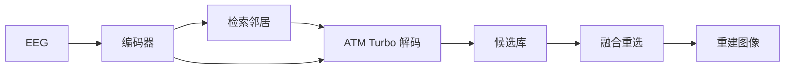

# 基于证据路由扩散控制的 EEG 视觉重建（ERDC）

> 数据集：THINGS-EEG2 主实验：sub-08

---

## 摘要

在候选选择阶段不访问测试图像真值的前提下，我们在官方 ATM 混合解码栈（SDXL-Turbo、IP-Adapter、低层 neighbor img2img）之上提出 **ERDC**（Evidence-Routed Diffusion Control，证据路由扩散控制）。ERDC 为解码器无关的后处理模块：扩大候选库，并依据脑一致性与检索结构融合评分重选输出。在 sub-08 上，主配置 **PixCorr 与官方 ATM 持平**（0.159），**CLIP cosine 提升 0.048**（0.418 vs. 0.370），**2-way CLIP 准确率 84.4%**（vs. 78.5%）。十被试被试内实验显示 CLIP **10/10 被试优于官方**，PixCorr 均值 **7/10 被试优于官方**。
---

## 1. 引言

从脑活动重建所见图像，是神经解码与生成式建模中的核心问题。ATM 等工作将 EEG 对齐至 CLIP 空间，并用预训练扩散模型生成图像，在 THINGS-EEG2 上建立了强基线；但单次前向生成往往难以同时兼顾像素保真与语义对齐。

本文将重建视为在 **检索约束的候选集合内路由证据**，而非一次性解码。ERDC 保持官方 ATM 解码器不变，仅增加多候选生成与系统化重选，可作为 **decoder-agnostic** 模块叠加于现有 EEG→图像流水线。

---

## 2. 方法

ERDC 包含三个环节：

1. **检索结构**：从训练集 gallery 检索邻居，为低层 img2img 提供结构条件。  
2. **脑一致选优**：以 EEG 嵌入与候选图 CLIP 特征的相似度评分。  
3. **融合证据重选**：综合脑一致与结构一致分数，在不使用测试 GT 的前提下选出最终图像。

编码器按被试训练；解码对齐官方 ATM Turbo 栈。候选库由多邻居、多 strength 构成，合并银行可进一步扩大搜索空间。

---

## 3. 实验设置

| 项目 | 设置 |
|------|------|
| 数据 | THINGS-EEG2，每被试 200 张测试图 |
| 指标 | PixCorr、CLIP cosine（ViT-H-14）、FID |
| 人类对齐 | 2-way CLIP（2WC） |
| 主评测 | sub-08，合并银行 + 融合重选（λ = 0.15） |
| 扩展 | 十被试被试内训练与测试 |
| 公平性 | 选优阶段不使用 GT |

**基线**：sub-08 对比官方 ATM 预生成结果；十被试对比各被试官方 Turbo 解码（diffusion prior + brain 选优）。

---

## 4. 结果

### 4.1 主结果（sub-08）

| 方法 | PixCorr | CLIP | 2WC (CLIP) |
|------|---------|------|------------|
| Official ATM | 0.159 | 0.370 | 78.5% |
| **ERDC（主方法，merge + fuse）** | **0.159** | **0.418** | **84.4%** |
| ERDC（mega bank + brain） | 0.163 | 0.406 | 84.6% |
| Turbo + ATM + brain | **0.173** | 0.379 | 81.6% |
| ERDC（mega fuse） | 0.148 | **0.421** | **86.3%** |

主方法 Bootstrap 95% CI：CLIP **0.418** [0.403, 0.434]，高于官方 **0.370** [0.354, 0.388]。

**要点**：主配置在 PixCorr 持平的同时显著提升语义指标；部分变体在像素（最高 0.173）或语义/2WC（mega fuse 86.3%）上进一步突出。

### 4.2 消融（sub-08）

| 研究 | 结论 |
|------|------|
| 解码栈 | SDXL CLIP 更高；Turbo PixCorr 更优；主实验采用与 ATM 对齐的 Turbo。 |
| 融合权重 λ | λ = 0.15 在合并银行上 Pix/CLIP 综合最优。 |
| 选优策略 | 多候选 brain / fuse 显著优于 first/random，并接近 oracle 上界。 |
| 候选库规模 | 多嵌入源与多 strength 合并可提升指标。 |

---

## 5. 十被试扩展

十名被试均在被试内协议下独立训练与评测；官方与 ERDC 均使用各被试编码器及相同 Turbo 解码栈。

| 指标 | Official（均值 ± 标准差） | ERDC（均值 ± 标准差） | 优于官方的被试数 |
|------|---------------------------|------------------------|------------------|
| PixCorr | 0.110 ± 0.021 | 0.123 ± 0.017 | 7 / 10 |
| CLIP | 0.313 ± 0.031 | 0.381 ± 0.020 | 10 / 10 |

CLIP 在所有被试上均有提升；PixCorr 在多数被试上提升，单被试最大 Pix 增益出现在 sub-06（+0.063）。

---

## 6. 结论

本研究提出 ERDC，一种可叠加于官方 ATM Turbo 解码器的证据路由控制模块，无需改动底层生成器。在 THINGS-EEG2 sub-08 上，ERDC 在 PixCorr 与官方持平时显著提升 CLIP 与 2WC；十被试被试内实验验证了 CLIP 增益的稳定性。
